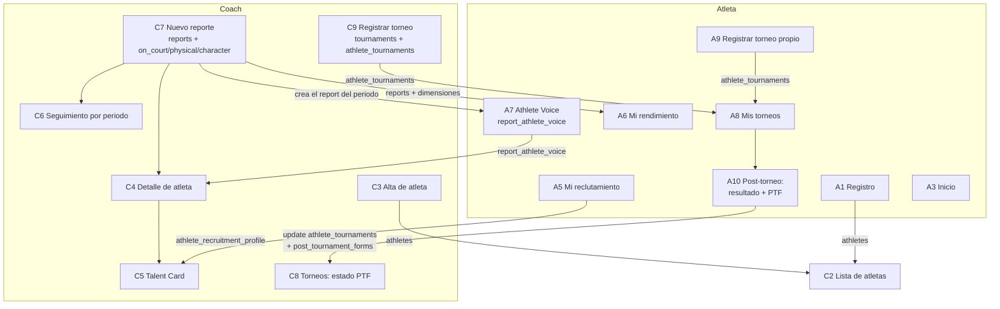

# Guía de QA — Funcionalidades y flujos end-to-end (Atleta + Coach)

> Para el tour de la plataforma previo a la presentación al equipo (12 Jun 2026).
> Cada paso indica **qué tabla de Supabase** debe reflejar el cambio, para confirmar que la data se guarda y se genera bien.

**Setup mínimo:** una cuenta Coach y una cuenta Atleta (idealmente en dos navegadores/ventanas en paralelo).

---

## 1. Funcionalidades por rol

### Atleta

| # | Funcionalidad | Ruta | Tablas que lee / escribe |
|---|---|---|---|
| A1 | Registro de cuenta | `/registro` | escribe `auth` + `athletes` |
| A2 | Login y sesión | `/login` | lee `athletes` (via `useAuth`) |
| A3 | Inicio (dashboard personal) | `/portal/inicio` | lee `athletes`, `reports`, `athlete_recruitment_profile` |
| A4 | Mi perfil (editar datos) | `/portal/mi-perfil` | lee/escribe `athletes` (update) |
| A5 | Mi reclutamiento | `/portal/mi-reclutamiento` | lee/escribe `athlete_recruitment_profile` (upsert) |
| A6 | Mi rendimiento | `/portal/mi-rendimiento` | lee `reports`, `report_on_court`, `report_character` |
| A7 | Athlete Voice (auto-evaluación) | `/portal/athlete-voice` | lee `reports`; escribe `report_athlete_voice` (upsert ×3 secciones) |
| A8 | Mis torneos | `/portal/mis-torneos` | lee `athlete_tournaments` |
| A9 | Registrar torneo propio | `/portal/torneos/nuevo` | escribe `tournaments` + `athlete_tournaments` (insert) |
| A10 | Post-torneo: resultado + PTF | `/portal/post-torneo/:torneoId` | escribe `athlete_tournaments` (update: ronda, score, victoria, modalidad) + `post_tournament_forms` (insert) |

### Coach

| # | Funcionalidad | Ruta | Tablas que lee / escribe |
|---|---|---|---|
| C1 | Login y sesión | `/login` | lee `coaches` |
| C2 | Lista de atletas | `/portal/alumnos` | lee `athletes` |
| C3 | Alta de atleta | `/portal/alumnos/nuevo` | escribe `athletes` (insert) |
| C4 | Detalle de atleta (expediente) | `/portal/alumnos/:id` | lee `athletes`, `reports`, `report_on_court`, `report_physical`, `report_character`, `report_athlete_voice` |
| C5 | Talent Card | `/portal/alumnos/:id/talent-card` | lee `athletes`, `reports`, `report_on_court`, `report_character`, `athlete_recruitment_profile` |
| C6 | Seguimiento por periodo | `/portal/reportes` | lee `reports`, `athletes` |
| C7 | Nuevo reporte (3 dimensiones) | `/portal/reportes/nuevo` | escribe `reports` (upsert por `athlete_id+period`) + `report_on_court`, `report_physical`, `report_character` (upsert) |
| C8 | Torneos (lista + estado PTF) | `/portal/torneos` | lee `tournaments`, `athlete_tournaments` |
| C9 | Registrar torneo multi-atleta | `/portal/torneos/registrar` | escribe `tournaments` + `athlete_tournaments` (insert múltiple; delete al desmarcar) |

> ⚠️ **Páginas legacy no ruteadas** (existen en `src/pages/portal/` pero no en `App.jsx`): `Expediente.jsx`, `Ejercicios.jsx`, `Perfil.jsx`, `Reportes.jsx`. No deberían aparecer en el tour; candidatas a borrar.
>
> ⚠️ **Navegación atleta:** el sidebar solo tiene Inicio, Mi rendimiento y Mis torneos. Verificar cómo llega el atleta a Mi perfil, Mi reclutamiento y Athlete Voice (¿topbar? ¿links en Inicio?). Si no hay camino visible, es un bug de navegación.

---

## 2. Mapa de conexiones entre flujos

**Las 4 cadenas end-to-end que hay que probar completas:**

1. **Alta → acceso:** Coach da de alta atleta (o atleta se registra) → atleta aparece en lista del coach → atleta puede hacer login y ver su Inicio.
2. **Reporte mensual:** Coach crea reporte del periodo (C7) → ese mismo `report` habilita el Athlete Voice del atleta (A7, upsert sobre `report_id`) → atleta ve sus números en Mi rendimiento (A6) → coach ve las 4 dimensiones + voz del atleta en Detalle (C4) y Talent Card (C5).
3. **Torneo → PTF:** Coach registra torneo con N atletas (C9) → cada atleta lo ve en Mis torneos (A8) → atleta llena resultado + PTF (A10) → coach ve estado de PTF por atleta en Torneos (C8). Variante: el torneo lo registra el propio atleta (A9).
4. **Reclutamiento:** Atleta llena Mi reclutamiento (A5) → datos aparecen en su Inicio (A3) y en la Talent Card del coach (C5).

---

## 3. Checklist de prueba end-to-end

Marca ✅ / ❌ y anota el bug abajo con su ID.

### Cadena 1 — Alta y acceso

- [ ] 1.1 Coach crea atleta en C3 → fila nueva en `athletes` con los campos correctos
- [ ] 1.2 Atleta nuevo se registra en `/registro` → se crea auth user + fila en `athletes`; verificar a qué coach queda asignado
- [ ] 1.3 Login atleta redirige a `/portal/inicio`; login coach a `/portal/alumnos` (lógica en Dashboard)
- [ ] 1.4 Atleta NO puede acceder a rutas de coach (`/portal/alumnos`) ni viceversa (probar URL directa)

### Cadena 2 — Reporte mensual

- [ ] 2.1 Coach crea reporte en C7 para atleta X, periodo actual → fila en `reports` (única por atleta+periodo) + filas en `report_on_court`, `report_physical`, `report_character`
- [ ] 2.2 Repetir C7 mismo atleta+periodo → NO duplica el report (upsert por `athlete_id,period`); actualiza valores
- [ ] 2.3 Atleta abre Athlete Voice → ve el periodo creado por el coach; guarda las 3 secciones → una sola fila en `report_athlete_voice` por `report_id` (las 3 secciones acumulan, no se pisan)
- [ ] 2.4 Atleta sin reporte del coach abre Athlete Voice → ¿qué pasa? (no debe crashear)
- [ ] 2.5 Mi rendimiento (A6) muestra los valores que el coach capturó (comparar números exactos contra Supabase)
- [ ] 2.6 Coach ve en C4 las dimensiones + lo que escribió el atleta; calificaciones 1–5 se muestran bien
- [ ] 2.7 Talent Card (C5) genera con datos reales; campos vacíos no rompen el layout

### Cadena 3 — Torneos y PTF

- [ ] 3.1 Coach registra torneo con 2+ atletas (C9) → 1 fila en `tournaments` + N filas en `athlete_tournaments`
- [ ] 3.2 Desmarcar un atleta antes de guardar → su fila se elimina (delete), no queda huérfana
- [ ] 3.3 Atleta registra torneo propio (A9) → fila en `tournaments` + `athlete_tournaments`; ¿el coach lo ve en C8?
- [ ] 3.4 Atleta llena post-torneo (A10): ronda (incl. Q1/Q2/Q3), score, victoria, modalidad → update en `athlete_tournaments` + insert en `post_tournament_forms`
- [ ] 3.5 Reenviar el PTF del mismo torneo → ¿duplica fila en `post_tournament_forms` o bloquea?
- [ ] 3.6 Coach ve PTF completado/pendiente por atleta en C8; estado correcto tras 3.4
- [ ] 3.7 RLS cross-coach: coach B no ve torneos/atletas de coach A (si ya hay 2 coaches en staging)

### Cadena 4 — Reclutamiento

- [ ] 4.1 Atleta guarda Mi reclutamiento → upsert en `athlete_recruitment_profile` (una fila por atleta)
- [ ] 4.2 Editar y reguardar → actualiza la misma fila
- [ ] 4.3 Datos aparecen en Inicio del atleta y en Talent Card del coach

### Transversal

- [ ] T1 Refresh (F5) dentro del portal mantiene la sesión y la página
- [ ] T2 Campos 1–5: probar valores fuera de rango / vacíos (bug conocido de validaciones)
- [ ] T3 Probar en móvil (los coaches lo usarán en cancha)
- [ ] T4 Mensajes de error visibles cuando Supabase falla (apagar wifi y guardar)

---

## 4. Bugs ya conocidos (no re-reportar)

De la sesión del 9 Jun: 6 bugs de escala pendientes de auditar — AlumnoDetalle, Expediente, validaciones de rango, unificar `avg()`, tests de pipeline. Pendiente también: evaluar si el PTF es demasiado largo para el lanzamiento.

---

## 5. Captura de bugs y sugerencias

### Bugs

| ID | Paso (ej. 2.3) | Rol | Qué pasó | Qué esperaba | Severidad (alta/media/baja) |
|---|---|---|---|---|---|
| B1 | | | | | |
| B2 | | | | | |

### Sugerencias de funcionalidad

| ID | Dónde surgió | Idea | ¿Para antes de invitar al equipo o backlog? |
|---|---|---|---|
| S1 | | | |
| S2 | | | |
